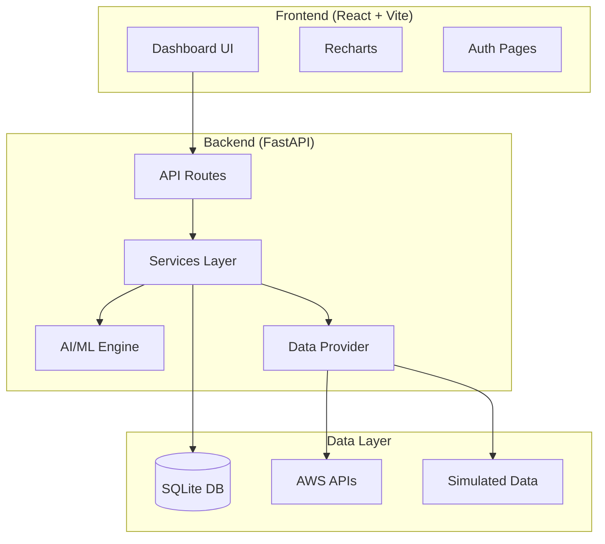

# Cloud FinOps AI Optimizer — Implementation Plan

## Overview

A production-quality full-stack SaaS application that helps businesses reduce cloud costs using data analysis and AI. The platform monitors cloud spending, detects anomalies, predicts future costs, identifies waste, and generates actionable cost-saving recommendations.

---

## Architecture



---

## Proposed Changes

### Backend — Python FastAPI

#### Folder Structure
```
backend/
├── main.py                    # FastAPI app entry point
├── requirements.txt           # Python dependencies
├── database.py                # SQLite setup & models
├── config.py                  # App configuration
├── data_provider.py           # Hybrid AWS/Mock data abstraction
├── auth.py                    # JWT authentication
├── routes/
│   ├── __init__.py
│   ├── cost.py                # /cost endpoints
│   ├── forecast.py            # /forecast endpoints
│   ├── anomalies.py           # /anomalies endpoints
│   ├── resources.py           # /resources endpoints
│   ├── recommendations.py     # /recommendations endpoints
│   ├── budget.py              # /budget endpoints
│   ├── insights.py            # /insights endpoints
│   ├── auth.py                # /auth endpoints
│   └── export.py              # /export endpoints
├── services/
│   ├── __init__.py
│   ├── cost_service.py        # Cost aggregation logic
│   ├── resource_service.py    # EC2 resource analysis
│   ├── recommendation_service.py
│   ├── budget_service.py
│   └── insight_service.py     # Template-based text insights
├── ai/
│   ├── __init__.py
│   ├── prediction.py          # Linear Regression + optional ARIMA
│   └── anomaly.py             # Isolation Forest + statistical methods
├── models/
│   ├── __init__.py
│   └── schemas.py             # Pydantic models
└── utils/
    ├── __init__.py
    └── helpers.py             # Utility functions
```

#### [NEW] `backend/main.py`
FastAPI application with CORS middleware, route registration, startup DB initialization.

#### [NEW] `backend/database.py`
SQLite schema with tables:
- `users` (id, email, password_hash, created_at)
- `cost_data` (id, date, service, amount, region)
- `resources` (id, instance_id, type, state, cpu_utilization, cost_per_hour, tags, environment)
- `budgets` (id, user_id, monthly_limit, alert_threshold)
- `alerts` (id, user_id, type, message, created_at, read)
- `savings_log` (id, recommendation_id, estimated_saving, status, created_at)

#### [NEW] `backend/data_provider.py`
Clean abstraction layer:
- Checks for AWS credentials (`boto3.Session`)
- If available: fetches from AWS Cost Explorer + EC2
- If not: generates realistic simulated data with:
  - Daily cost trends with seasonal patterns
  - Random spikes (anomalies)
  - Service breakdown (EC2 ~45%, S3 ~15%, RDS ~20%, Lambda ~10%, Others ~10%)
  - Idle EC2 instances with low CPU utilization

#### [NEW] `backend/ai/prediction.py`
- Linear Regression model for 7-30 day forecast
- Feature engineering: day-of-week, month, trend
- Returns prediction array with confidence intervals

#### [NEW] `backend/ai/anomaly.py`
- Isolation Forest for anomaly detection
- Moving average comparison (Z-score based)
- Returns anomalies with explanations like "Cost spike detected: 45% higher than expected trend"

#### [NEW] `backend/services/recommendation_service.py`
- Rule-based + ML insight recommendations:
  - Reserved Instance savings
  - Right-sizing suggestions
  - Idle resource termination
  - Service-specific optimizations
- Each recommendation includes estimated savings and confidence level

---

### Frontend — React + Vite

#### Folder Structure
```
frontend/
├── index.html
├── package.json
├── vite.config.js
├── src/
│   ├── main.jsx
│   ├── App.jsx
│   ├── App.css
│   ├── index.css                # Global styles + design system
│   ├── api/
│   │   └── client.js            # Axios API client
│   ├── context/
│   │   └── AuthContext.jsx      # Auth state management
│   ├── pages/
│   │   ├── Dashboard.jsx        # Main dashboard
│   │   ├── Login.jsx            # Login page
│   │   └── Signup.jsx           # Signup page
│   └── components/
│       ├── Sidebar.jsx          # Navigation sidebar
│       ├── Header.jsx           # Top header bar
│       ├── CostOverview.jsx     # Total cost + trends
│       ├── CostBreakdown.jsx    # Service-wise pie/bar chart
│       ├── ForecastChart.jsx    # AI prediction graph
│       ├── AnomalyPanel.jsx     # Anomaly alerts
│       ├── IdleResources.jsx    # Idle EC2 table
│       ├── Recommendations.jsx  # Cost-saving recommendations
│       ├── SavingsTracker.jsx   # Money saved widget
│       ├── BudgetWidget.jsx     # Budget progress + alerts
│       ├── InsightsPanel.jsx    # AI-generated text insights
│       ├── TopActions.jsx       # Top 3 cost-saving actions
│       ├── AlertsPanel.jsx      # System alerts
│       └── ExportButton.jsx     # CSV/PDF export
```

#### Design System
- **Theme**: Dark mode with gradient accents
- **Colors**: Deep navy (#0a0e27), card backgrounds (#111638), accent blues/purples (#667eea → #764ba2), success greens, warning ambers, error reds
- **Typography**: Inter (Google Fonts)
- **Cards**: Glassmorphic with subtle borders and shadows
- **Animations**: Smooth fade-ins, hover effects, subtle transitions

---

## API Routes

| Method | Route | Description |
|--------|-------|-------------|
| POST | `/auth/signup` | User registration |
| POST | `/auth/login` | User login (JWT) |
| GET | `/cost/daily` | Daily cost data with date range |
| GET | `/cost/monthly` | Monthly cost summary |
| GET | `/cost/breakdown` | Service-wise breakdown |
| GET | `/forecast` | AI cost prediction (7-30 days) |
| GET | `/anomalies` | Detected anomalies |
| GET | `/resources/idle` | Idle EC2 instances |
| GET | `/recommendations` | AI-driven recommendations |
| GET | `/budget` | Budget status |
| POST | `/budget` | Set/update budget |
| GET | `/insights` | AI-generated text insights |
| GET | `/savings` | Savings tracker data |
| GET | `/export/csv` | Export data as CSV |
| GET | `/alerts` | User alerts |

---

## Simulated Data Strategy

The mock data generator will create **6 months of historical data** with:

1. **Base cost curve**: Gradual upward trend (realistic cloud growth)
2. **Weekly seasonality**: Higher weekday costs, lower weekends
3. **Service distribution**: EC2 (45%), S3 (15%), RDS (20%), Lambda (10%), CloudWatch (5%), Others (5%)
4. **Anomaly injection**: 3-5 random spikes (30-80% above normal)
5. **Idle resources**: 4-6 EC2 instances with CPU < 5%, tagged with environments
6. **Budget**: Set at 80% of peak month spend

---

## User Review Required

> [!IMPORTANT]
> **Currency**: The requirements mention ₹ (INR). I'll use **USD ($)** as the default currency since AWS Cost Explorer reports in USD, but can switch to INR if preferred.

> [!IMPORTANT]
> **Authentication**: I'll implement basic JWT auth with login/signup. No OAuth or third-party providers unless requested.

> [!IMPORTANT]
> **Database seeding**: On first startup, the backend will auto-seed the SQLite database with simulated data so the app works immediately without AWS credentials.

---

## Open Questions

1. **Currency preference**: Should the app display costs in USD or INR (₹)?
2. **Port preferences**: I'll use `8000` for backend and `5173` for frontend (Vite default). Any preferences?

---

## Verification Plan

### Automated Tests
- Start backend server and verify all API endpoints return valid JSON
- Start frontend dev server and verify it renders without errors
- Test the AI prediction module with sample data
- Verify anomaly detection identifies injected spikes

### Manual Verification
- Open dashboard in browser and verify all widgets render with data
- Check chart interactivity (tooltips, date ranges)
- Test login/signup flow
- Test budget setting and alert triggering
- Verify CSV export downloads correctly
- Test responsive layout
